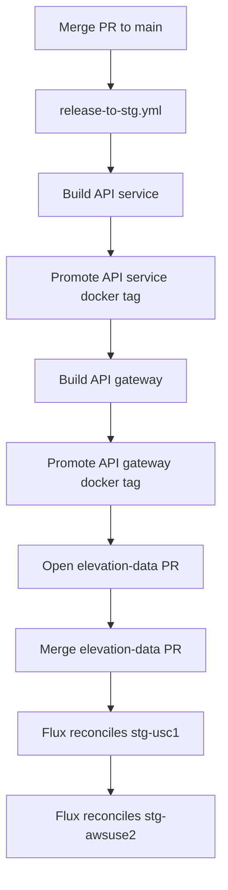
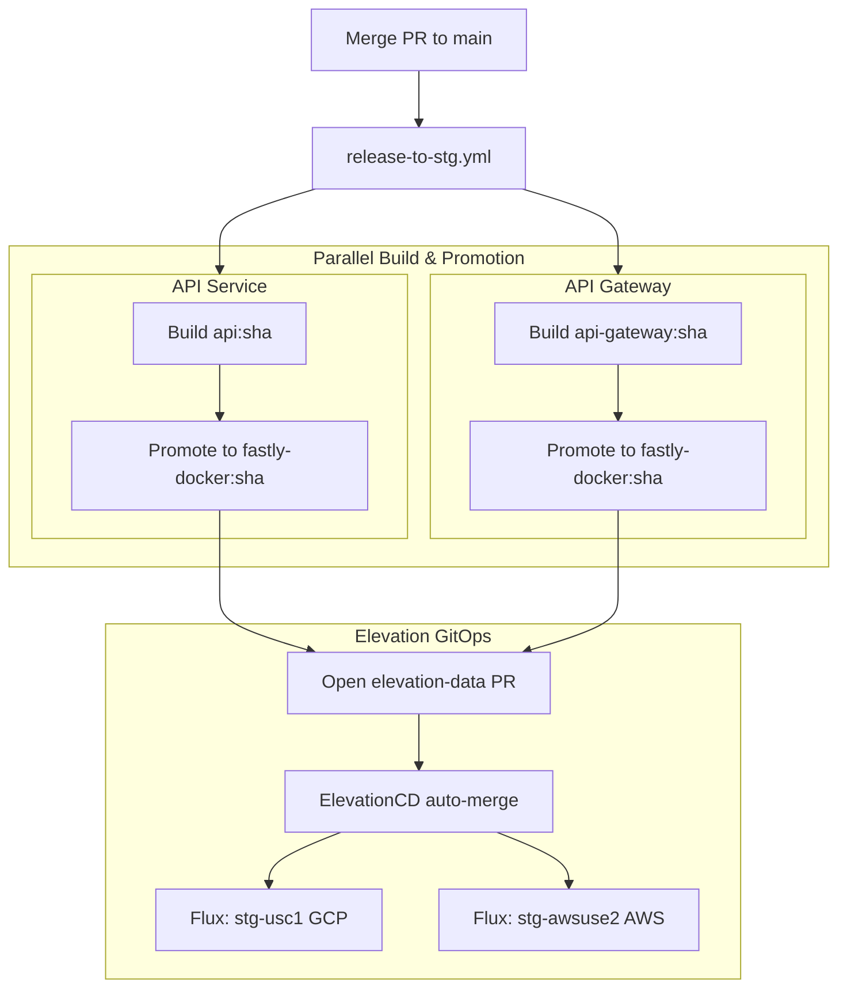

---
paths:
  - '**/*.{mmd,mermaid}'
---

We write clean, readable Mermaid diagrams that communicate system structure
without awkward rendering artifacts.

## Verification with `mmdc`

Always validate Mermaid diagrams with the Mermaid CLI (`mmdc`) before inserting
them into documents. AI models frequently produce invalid syntax or awkward
layouts that render illegibly.

### Installation

If `mmdc` is not installed on the system:

```bash
npm install -g @mermaid-js/mermaid-cli
```

Verify installation:

```bash
mmdc --version
```

### Validation step

1. Write the diagram to a temporary file:
   ```bash
   cat << 'EOF' > /tmp/diagram.mmd
   flowchart TD
       ...
   EOF
   ```
2. Render to PNG to verify syntax:
   ```bash
   mmdc -i /tmp/diagram.mmd -o /tmp/diagram.png
   ```
   If syntax is invalid, `mmdc` exits non-zero and prints the line error.
3. Visually verify the rendered image using the `read` tool:
   - Check that text is legible and not clipped.
   - Check that the diagram is not zoomed out into an unreadable thin strip.

## Image Export

Keep image export separate from syntax validation. Render a local image only
when the user explicitly asks to save the image, save a copy, put it on their
machine, or uses equivalent wording. Inspection, preview, and validation alone
do not request a saved image.

When the user requests a saved image:

1. Write the Mermaid source to a unique path under `/tmp/`, such as
   `/tmp/mermaid-<random-id>.mmd`. Do not overwrite an existing diagram source
   or image.
2. Use the bundled stylesheet [`mermaid.css`](../skills/conventions-mermaid/mermaid.css)
   as `--cssFile`. Resolve the link against this file's directory into an
   absolute path, and set `css=` to it before running `mmdc`.
3. Add a top-level `fontFamily` of `Menlo, monospace` to the Mermaid init
   configuration. Use only Menlo with the generic `monospace` fallback.
4. Use `theme: "base"` and `themeVariables` for global colors. Use explicit
   `style <subgraph-id>` directives for different boundary colors and
   `classDef` plus `class` for consistent node boxes. Global theme variables do
   not make individual subgraphs use different colors.
5. Generate a random output filename under `/tmp/`, for example with
   `uuidgen`, and always pass `--backgroundColor white`:

   ```bash
   id="$(uuidgen | tr '[:upper:]' '[:lower:]')"
   input="/tmp/mermaid-${id}.mmd"
   output="/tmp/mermaid-${id}.png"

   mmdc \
     --input "$input" \
     --output "$output" \
     --cssFile "$css" \
     --backgroundColor white

   printf 'Saved image: %s\n' "$output"
   ```

6. Read the generated image and check that text is legible and not clipped.
7. Add `--scale 2` for a 2x PNG or `--scale 3` for a 3x PNG when the user
   requests a much larger image. `--scale` increases raster resolution without
   changing the diagram layout.

Use the top-level Mermaid `fontFamily`, not CSS alone, so Mermaid measures text
with the selected font before calculating layout. CSS-only font overrides can
clip labels after layout. Always report the exact random output path to the
user.

A PNG does not contain the Mermaid source or theme configuration. Exact
reproduction requires the source, configuration, custom CSS, and compatible
Mermaid versions.

## Layout & Structure Guidelines

Mermaid layouts are sensitive to node hierarchy and flow direction. A poorly
structured diagram forces Mermaid's engine into extreme aspect ratios.

### 1. Avoid flat linear chains

Do not create long, single-column vertical chains
(`A --> B --> C --> D --> E --> F ...`). They render as tall, thin, zoomed-out
columns with tiny, unreadable text.

### 2. Group into semantic subgraphs

Decompose processes into logical phases, systems, or ownership domains using
`subgraph`. This chunks the flow, provides visual boundaries, and improves
layout balance.

### 3. Surface parallelism & fan-in / fan-out

Do not serialize independent steps. If tasks run concurrently (e.g. parallel
builds, multi-region deployments, dual checks), branch them side by side and
converge downstream. This creates a natural horizontal width that balances
vertical depth.

## Example: Linear vs Structured

### Bad: Flat single-column chain (zoomed out, uninformative)



### Good: Subgraphs with parallel branches & fan-in / fan-out


