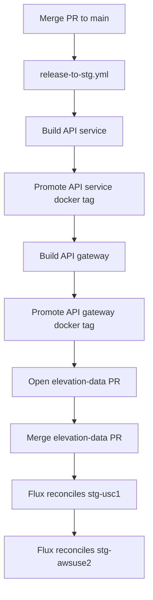
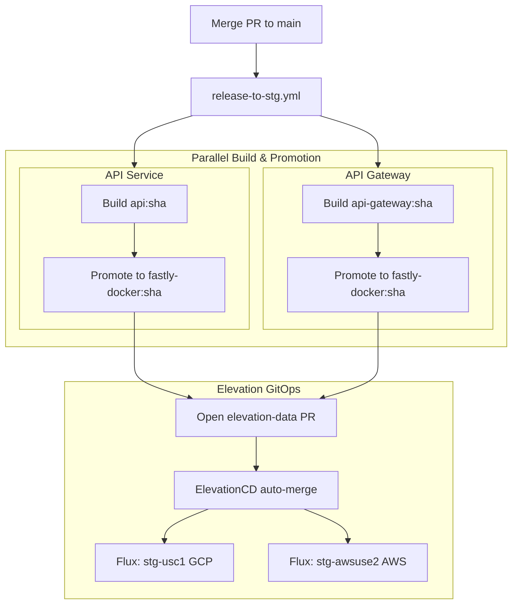

---
paths:
  - '**/*.{mmd,mermaid}'
---

We write clean, readable Mermaid diagrams that communicate system structure
without awkward rendering artifacts.

## Verification with `mmdc`

Always validate Mermaid diagrams with the Mermaid CLI (`mmdc`) before inserting
them into documents. AI models frequently produce invalid syntax or awkward
layouts that render illegibly.

### Installation

If `mmdc` is not installed on the system:

```bash
npm install -g @mermaid-js/mermaid-cli
```

Verify installation:

```bash
mmdc --version
```

### Validation step

1. Write the diagram to a temporary file:
   ```bash
   cat << 'EOF' > /tmp/diagram.mmd
   flowchart TD
       ...
   EOF
   ```
2. Render to PNG to verify syntax:
   ```bash
   mmdc -i /tmp/diagram.mmd -o /tmp/diagram.png
   ```
   If syntax is invalid, `mmdc` exits non-zero and prints the line error.
3. Visually verify the rendered image using the `read` tool:
   - Check that text is legible and not clipped.
   - Check that the diagram is not zoomed out into an unreadable thin strip.

## Layout & Structure Guidelines

Mermaid layouts are sensitive to node hierarchy and flow direction. A poorly
structured diagram forces Mermaid's engine into extreme aspect ratios.

### 1. Avoid flat linear chains

Do not create long, single-column vertical chains
(`A --> B --> C --> D --> E --> F ...`). They render as tall, thin, zoomed-out
columns with tiny, unreadable text.

### 2. Group into semantic subgraphs

Decompose processes into logical phases, systems, or ownership domains using
`subgraph`. This chunks the flow, provides visual boundaries, and improves
layout balance.

### 3. Surface parallelism & fan-in / fan-out

Do not serialize independent steps. If tasks run concurrently (e.g. parallel
builds, multi-region deployments, dual checks), branch them side by side and
converge downstream. This creates a natural horizontal width that balances
vertical depth.

## Example: Linear vs Structured

### Bad: Flat single-column chain (zoomed out, uninformative)



### Good: Subgraphs with parallel branches & fan-in / fan-out


